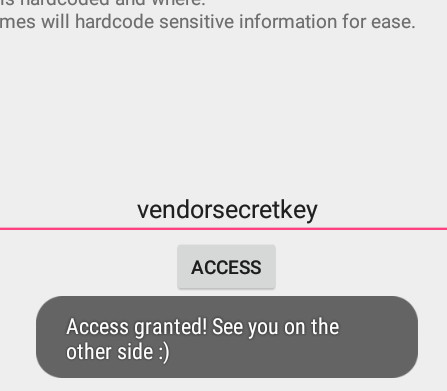
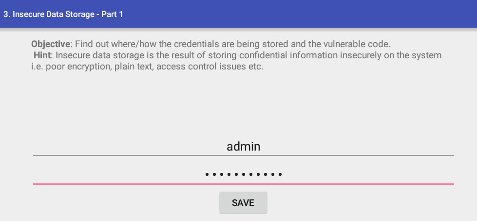
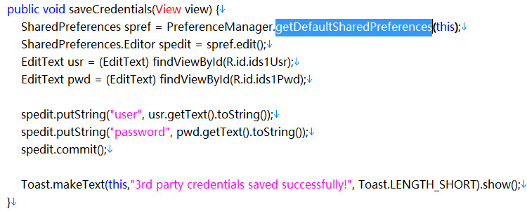
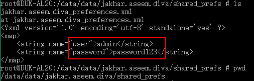

## 1. Insecure Logging

D:\appsec\platform-tools_r29.0.1-windows\platform-tools>**`adb shell ps| findstr diva`**  
u0_a4     10273 77    1541480 43112 ffffffff b7558ce5 S jakhar.aseem.diva  

D:\appsec\platform-tools_r29.0.1-windows\platform-tools>**`adb shell logcat | findstr 10273`**  
E/libprocessgroup(10273): failed to make and chown /acct/uid_10004: Read-only fi
le system  
I/ActivityManager(  420): Start proc 10273:jakhar.aseem.diva/u0a4 for activity j
akhar.aseem.diva/.MainActivity  
D/OpenGLRenderer(10273): endAllStagingAnimators on 0xb3f53a80 (RippleDrawable) w
ith handle 0xadc297c0  
E/diva-log(10273): Error while processing transaction with credit card: **12312312
31234**   
V/RenderScript(10273): 0xa14ca400 Launching thread(s), CPUs 2  

可以看到logcat打印出输入的信用卡信息。

### logcat知识点

Android Logcat使用起来可以方便的观察调试内容，基本上的使用方法(巧用Logcat调试程序)。

一、Log.v 的调试颜色为黑色的，任何消息都会输出，这里的v代表verbose啰嗦的意思，平时使用就是Log.v(“”,”“);

二、Log.d的输出颜色是蓝色的，仅输出debug调试的意思，但他会输出上层的信息，过滤起来可以通过DDMS的Logcat标签来选择

三、Log.i的输出为绿色，一般提示性的消息information，它不会输出Log.v和Log.d的信息，但会显示i、w和e的信息

四、Log.w的意思为橙色，可以看作为warning警告，一般需要我们注意优化Android代码，同时选择它后还会输出Log.e的信息。

五、Log.e为红色，可以想到error错误，这里仅显示红色的错误信息，这些错误就需要我们认真的分析，查看栈的信息了。

这些区别就是在DDMS的Logcat显示的颜色的区别

## 2. Hardcoding Issues    
通过查看HardcodeActivity.java文件，可以看到hckey与vendorsecretkey比较，将vendorsecretkey输入即可。
```

    public void access(View view) {
        EditText hckey = (EditText) findViewById(R.id.hcKey);

        if (hckey.getText().toString().equals("vendorsecretkey")) {
            Toast.makeText(this, "Access granted! See you on the other side :)", Toast.LENGTH_SHORT).show();
        }
        else {
            Toast.makeText(this, "Access denied! See you in hell :D", Toast.LENGTH_SHORT).show();
        }
    }
 ```



## Insecure Data Storage -Part1
不安全的数据存储主要有三种方式：    
- 将敏感数据保存到配置文件中。
- 将敏感数据保存在本地的sqlite3数据库中。
- 将敏感数据保存在临时文件或者sd卡中。


源代码：

SharedPreferences类存储的数据会以.xml的形式存储在`/data/data/apppackagename/shared_prefs `
adb下查看该文件可以看到敏感信息，文件路径：
`/data/data/jakhar.aseem.diva/shared_prefs/jakhar.aseem.diva_preferences.xml`


## 4.Insecure Data Storage -Part2
用户的敏感信息存储到本地的数据库中，一般app对应的数据库目录:`/data/data/apppackagename/databases`
文件路径：`/data/data/jakhar.aseem.diva/databases/ids2`
```
protected void onCreate(Bundle savedInstanceState) {
        super.onCreate(savedInstanceState);
        try {
            mDB = openOrCreateDatabase("ids2", MODE_PRIVATE, null);
            mDB.execSQL("CREATE TABLE IF NOT EXISTS myuser(user VARCHAR, password VARCHAR);");
        }
```
```
    public void saveCredentials(View view) {
        EditText usr = (EditText) findViewById(R.id.ids2Usr);
        EditText pwd = (EditText) findViewById(R.id.ids2Pwd);
        try {
            mDB.execSQL("INSERT INTO myuser VALUES ('"+ usr.getText().toString() +"', '"+ pwd.getText().toString() +"');");
            mDB.close();
        }
```

数据库路径：/data/data/jakhar.aseem.diva/databases
```
root@SM-G930F:/data/data/jakhar.aseem.diva/databases # ls
divanotes.db
divanotes.db-journal
ids2
ids2-journal
root@SM-G930F:/data/data/jakhar.aseem.diva/databases #
root@SM-G930F:/data/data/jakhar.aseem.diva/databases # sqlite3 ids2
SQLite version 3.8.6.1 2015-05-21 17:24:32
Enter ".help" for usage hints.
sqlite> show tables;
Error: near "show": syntax error
sqlite> .tables
android_metadata  myuser
sqlite> select * from myuser;
test_name|test_password2
sqlite>
```
sqlite3命令参考：https://www.runoob.com/sqlite/sqlite-commands.html
## Insecure Data Storage -Part3
这一关是把用户名密码写到一个临时文件中了。
文件路径：`/data/data/jakhar.aseem.diva/uinfo-1681723197tmp`
```
root@DUK-AL20:/data/data/jakhar.aseem.diva # ls
cache
databases
lib
shared_prefs
uinfo-1681723197tmp
root@DUK-AL20:/data/data/jakhar.aseem.diva # cat uinfo-1681723197tmp
test3:password3
root@DUK-AL20:/data/data/jakhar.aseem.diva #
```
代码片段：
```
 public void saveCredentials(View view) {
        EditText usr = (EditText) findViewById(R.id.ids3Usr);
        EditText pwd = (EditText) findViewById(R.id.ids3Pwd);

        File ddir =  new File(getApplicationInfo().dataDir);

        try {
            File uinfo = File.createTempFile("uinfo", "tmp", ddir);
            uinfo.setReadable(true);
            uinfo.setWritable(true);
            FileWriter fw = new FileWriter(uinfo);
            fw.write(usr.getText().toString() + ":" + pwd.getText().toString() + "\n");
            fw.close();
            Toast.makeText(this, "3rd party credentials saved successfully!", Toast.LENGTH_SHORT).show();
            // Now you can read the temporary file where ever the credentials are required.
        }
```
## Insecure Data Storage -Part4
这一关将用户名密码存储到sd卡路径下`.uinfo.txt`文件中了。
代码片段：
```
public void saveCredentials(View view) {
        EditText usr = (EditText) findViewById(R.id.ids4Usr);
        EditText pwd = (EditText) findViewById(R.id.ids4Pwd);

        File sdir = Environment.getExternalStorageDirectory();

        try {
            File uinfo = new File(sdir.getAbsolutePath() + "/.uinfo.txt");
            uinfo.setReadable(true);
            uinfo.setWritable(true);
            FileWriter fw = new FileWriter(uinfo);
            fw.write(usr.getText().toString() + ":" + pwd.getText().toString() + "\n");
            fw.close();
            Toast.makeText(this, "3rd party credentials saved successfully!", Toast.LENGTH_SHORT).show();
            // Now you can read the temporary file where ever the credentials are required.
        }
```
获取sd卡绝对路径，`File sdir = Environment.getExternalStorageDirectory();`，并存储为隐藏文件`.uinfo.txt`
```
130|root@DUK-AL20:/ # cd /mnt/sdcard/
root@DUK-AL20:/mnt/sdcard # ls -al
-rw-rw---- root     sdcard_r       16 2019-06-19 20:27 .uinfo.txt
drwxrwx--- root     sdcard_r          2016-05-31 17:34 0
drwxrwx--- root     sdcard_r          2019-06-17 21:22 Alarms
drwxrwx--x root     sdcard_r          2019-01-25 16:42 Android
drwxrwx--- root     sdcard_r          2019-06-17 21:22 DCIM
drwxrwxrwx sdcard_rw sdcard_rw          2019-06-19 19:18 Download
drwxrwxrwx sdcard_rw sdcard_rw          2019-06-17 20:21 Movies
drwxrwxrwx sdcard_rw sdcard_rw          2019-06-17 20:21 Music
drwxrwx--- root     sdcard_r          2019-06-17 21:22 Notifications
drwxrwxrwx sdcard_rw sdcard_rw          2019-06-17 20:21 Pictures
drwxrwx--- root     sdcard_r          2019-06-17 21:22 Podcasts
drwxrwx--- root     sdcard_r          2019-06-17 21:22 Ringtones
drwxrwx--- root     sdcard_r          2016-05-31 17:30 legacy
drwxrwx--- root     sdcard_r          2019-06-17 21:28 marketSp
drwxrwx--- root     sdcard_r          2016-05-31 17:30 obb
drwxrwx--- root     sdcard_r          2019-06-17 21:29 storage
drwxrwx--- root     sdcard_r          2019-06-17 21:28 xysdk
root@DUK-AL20:/mnt/sdcard # cat .uinfo.txt
test4:password4
root@DUK-AL20:/mnt/sdcard #
```
