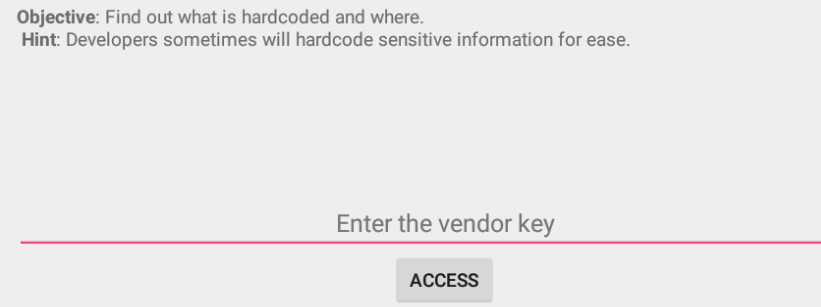
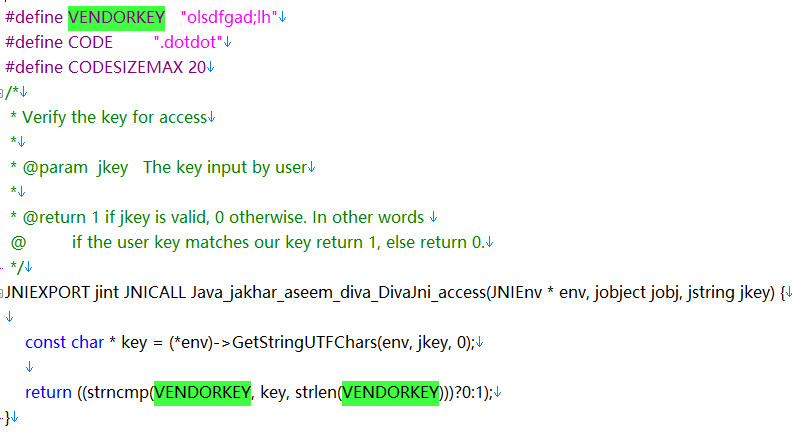

## 1. Insecure Logging

D:\appsec\platform-tools_r29.0.1-windows\platform-tools>**`adb shell ps| findstr diva`**  
u0_a4     10273 77    1541480 43112 ffffffff b7558ce5 S jakhar.aseem.diva  

D:\appsec\platform-tools_r29.0.1-windows\platform-tools>**`adb shell logcat | findstr 10273`**  
E/libprocessgroup(10273): failed to make and chown /acct/uid_10004: Read-only fi
le system  
I/ActivityManager(  420): Start proc 10273:jakhar.aseem.diva/u0a4 for activity j
akhar.aseem.diva/.MainActivity  
D/OpenGLRenderer(10273): endAllStagingAnimators on 0xb3f53a80 (RippleDrawable) w
ith handle 0xadc297c0  
E/diva-log(10273): Error while processing transaction with credit card: **12312312
31234**   
V/RenderScript(10273): 0xa14ca400 Launching thread(s), CPUs 2  

可以看到logcat打印出输入的信用卡信息。

### logcat知识点

Android Logcat使用起来可以方便的观察调试内容，基本上的使用方法(巧用Logcat调试程序)。

一、Log.v 的调试颜色为黑色的，任何消息都会输出，这里的v代表verbose啰嗦的意思，平时使用就是Log.v(“”,”“);

二、Log.d的输出颜色是蓝色的，仅输出debug调试的意思，但他会输出上层的信息，过滤起来可以通过DDMS的Logcat标签来选择

三、Log.i的输出为绿色，一般提示性的消息information，它不会输出Log.v和Log.d的信息，但会显示i、w和e的信息

四、Log.w的意思为橙色，可以看作为warning警告，一般需要我们注意优化Android代码，同时选择它后还会输出Log.e的信息。

五、Log.e为红色，可以想到error错误，这里仅显示红色的错误信息，这些错误就需要我们认真的分析，查看栈的信息了。

这些区别就是在DDMS的Logcat显示的颜色的区别

## 2. Hardcoding Issues    
通过查看HardcodeActivity.java文件，可以看到hckey与vendorsecretkey比较，将vendorsecretkey输入即可。
```java

    public void access(View view) {
        EditText hckey = (EditText) findViewById(R.id.hcKey);

        if (hckey.getText().toString().equals("vendorsecretkey")) {
            Toast.makeText(this, "Access granted! See you on the other side :)", Toast.LENGTH_SHORT).show();
        }
        else {
            Toast.makeText(this, "Access denied! See you in hell :D", Toast.LENGTH_SHORT).show();
        }
    }
 ```


## 3. Insecure Data Storage -Part1
不安全的数据存储主要有三种方式：    
- 将敏感数据保存到配置文件中。
- 将敏感数据保存在本地的sqlite3数据库中。
- 将敏感数据保存在临时文件或者sd卡中。


源代码：


SharedPreferences类存储的数据会以.xml的形式存储在`/data/data/apppackagename/shared_prefs `

adb下查看该文件可以看到敏感信息，文件路径：

`/data/data/jakhar.aseem.diva/shared_prefs/jakhar.aseem.diva_preferences.xml`


## 4. Insecure Data Storage -Part2
用户的敏感信息存储到本地的数据库中，一般app对应的数据库目录:`/data/data/apppackagename/databases`
文件路径：`/data/data/jakhar.aseem.diva/databases/ids2`
```java
protected void onCreate(Bundle savedInstanceState) {
        super.onCreate(savedInstanceState);
        try {
            mDB = openOrCreateDatabase("ids2", MODE_PRIVATE, null);
            mDB.execSQL("CREATE TABLE IF NOT EXISTS myuser(user VARCHAR, password VARCHAR);");
        }
```
```
    public void saveCredentials(View view) {
        EditText usr = (EditText) findViewById(R.id.ids2Usr);
        EditText pwd = (EditText) findViewById(R.id.ids2Pwd);
        try {
            mDB.execSQL("INSERT INTO myuser VALUES ('"+ usr.getText().toString() +"', '"+ pwd.getText().toString() +"');");
            mDB.close();
        }
```

数据库路径：/data/data/jakhar.aseem.diva/databases
```
root@SM-G930F:/data/data/jakhar.aseem.diva/databases # ls
divanotes.db
divanotes.db-journal
ids2
ids2-journal
root@SM-G930F:/data/data/jakhar.aseem.diva/databases #
root@SM-G930F:/data/data/jakhar.aseem.diva/databases # sqlite3 ids2
SQLite version 3.8.6.1 2015-05-21 17:24:32
Enter ".help" for usage hints.
sqlite> show tables;
Error: near "show": syntax error
sqlite> .tables
android_metadata  myuser
sqlite> select * from myuser;
test_name|test_password2
sqlite>
```
sqlite3命令参考：https://www.runoob.com/sqlite/sqlite-commands.html
## 5. Insecure Data Storage -Part3
这一关是把用户名密码写到一个临时文件中了。
文件路径：`/data/data/jakhar.aseem.diva/uinfo-1681723197tmp`
```
root@DUK-AL20:/data/data/jakhar.aseem.diva # ls
cache
databases
lib
shared_prefs
uinfo-1681723197tmp
root@DUK-AL20:/data/data/jakhar.aseem.diva # cat uinfo-1681723197tmp
test3:password3
root@DUK-AL20:/data/data/jakhar.aseem.diva #
```
代码片段：
```java
 public void saveCredentials(View view) {
        EditText usr = (EditText) findViewById(R.id.ids3Usr);
        EditText pwd = (EditText) findViewById(R.id.ids3Pwd);

        File ddir =  new File(getApplicationInfo().dataDir);

        try {
            File uinfo = File.createTempFile("uinfo", "tmp", ddir);
            uinfo.setReadable(true);
            uinfo.setWritable(true);
            FileWriter fw = new FileWriter(uinfo);
            fw.write(usr.getText().toString() + ":" + pwd.getText().toString() + "\n");
            fw.close();
            Toast.makeText(this, "3rd party credentials saved successfully!", Toast.LENGTH_SHORT).show();
            // Now you can read the temporary file where ever the credentials are required.
        }
```
## 6. Insecure Data Storage -Part4
这一关将用户名密码存储到sd卡路径下`.uinfo.txt`文件中了。
代码片段：
```java
public void saveCredentials(View view) {
        EditText usr = (EditText) findViewById(R.id.ids4Usr);
        EditText pwd = (EditText) findViewById(R.id.ids4Pwd);

        File sdir = Environment.getExternalStorageDirectory();

        try {
            File uinfo = new File(sdir.getAbsolutePath() + "/.uinfo.txt");
            uinfo.setReadable(true);
            uinfo.setWritable(true);
            FileWriter fw = new FileWriter(uinfo);
            fw.write(usr.getText().toString() + ":" + pwd.getText().toString() + "\n");
            fw.close();
            Toast.makeText(this, "3rd party credentials saved successfully!", Toast.LENGTH_SHORT).show();
            // Now you can read the temporary file where ever the credentials are required.
        }
```
获取sd卡绝对路径，`File sdir = Environment.getExternalStorageDirectory();`，并存储为隐藏文件`.uinfo.txt`
```
130|root@DUK-AL20:/ # cd /mnt/sdcard/
root@DUK-AL20:/mnt/sdcard # ls -al
-rw-rw---- root     sdcard_r       16 2019-06-19 20:27 .uinfo.txt
drwxrwx--- root     sdcard_r          2016-05-31 17:34 0
drwxrwx--- root     sdcard_r          2019-06-17 21:22 Alarms
drwxrwx--x root     sdcard_r          2019-01-25 16:42 Android
drwxrwx--- root     sdcard_r          2019-06-17 21:22 DCIM
drwxrwxrwx sdcard_rw sdcard_rw          2019-06-19 19:18 Download
drwxrwxrwx sdcard_rw sdcard_rw          2019-06-17 20:21 Movies
drwxrwxrwx sdcard_rw sdcard_rw          2019-06-17 20:21 Music
drwxrwx--- root     sdcard_r          2019-06-17 21:22 Notifications
drwxrwxrwx sdcard_rw sdcard_rw          2019-06-17 20:21 Pictures
drwxrwx--- root     sdcard_r          2019-06-17 21:22 Podcasts
drwxrwx--- root     sdcard_r          2019-06-17 21:22 Ringtones
drwxrwx--- root     sdcard_r          2016-05-31 17:30 legacy
drwxrwx--- root     sdcard_r          2019-06-17 21:28 marketSp
drwxrwx--- root     sdcard_r          2016-05-31 17:30 obb
drwxrwx--- root     sdcard_r          2019-06-17 21:29 storage
drwxrwx--- root     sdcard_r          2019-06-17 21:28 xysdk
root@DUK-AL20:/mnt/sdcard # cat .uinfo.txt
test4:password4
root@DUK-AL20:/mnt/sdcard #
```
## 7. Input Validation Issues-Part1
输入admin，提示出用户名密码信息，输入单引号"'"，通过logcat发现有错误信息：

```
D/Diva-sqli( 1434): Error occurred while searching in database: unrecognized token: "'''" (code 1): , while compiling: SELECT * FROM sqliuser WHERE user = '''
D/Diva-sqli( 1434): Error occurred while searching in database: unrecognized token: "'''" (code 1): , while compiling: SELECT * FROM sqliuser WHERE user = '''
```
典型的sql注入漏洞，输入`' or '1'='1`，将所有信息注入显示出来。
代码：    
```java
public void search(View view) {
        EditText srchtxt = (EditText) findViewById(R.id.ivi1search);
        Cursor cr = null;
        try {
            cr = mDB.rawQuery("SELECT * FROM sqliuser WHERE user = '" + srchtxt.getText().toString() + "'", null);
            StringBuilder strb = new StringBuilder("");
            if ((cr != null) && (cr.getCount() > 0)) {
                cr.moveToFirst();

                do {
                    strb.append("User: (" + cr.getString(0) + ") pass: (" + cr.getString(1) + ") Credit card: (" + cr.getString(2) + ")\n");
                } while (cr.moveToNext());
            }
            else {
                strb.append("User: (" + srchtxt.getText().toString() +") not found");
            }
            Toast.makeText(this, strb.toString(), Toast.LENGTH_SHORT).show();
        }
        catch(Exception e) {
            Log.d("Diva-sqli", "Error occurred while searching in database: " + e.getMessage());
        }
    }
```

## 8. Input Validation Issues-Part2
提示`Enter the URL to view`，程序的本意是输入一个URL，调用浏览器打开。但是，这种情况可用于使用不同的协议来利用浏览器HTTP，例如**File** 协议，用于读取内部文件系统的内容，甚至是外部存储器中的数据。如：`file://mnt/sdcard/.uinfo.txt`，这样就导致了任意文件读取漏洞。


代码片段：

```java
    @Override
    protected void onCreate(Bundle savedInstanceState) {
        super.onCreate(savedInstanceState);

        setContentView(R.layout.activity_input_validation2_urischeme);
        WebView wview = (WebView) findViewById(R.id.ivi2wview);
        WebSettings wset = wview.getSettings();
        wset.setJavaScriptEnabled(true);

    }

    public void get(View view) {
        EditText uriText = (EditText) findViewById(R.id.ivi2uri);
        WebView wview = (WebView) findViewById(R.id.ivi2wview);

        wview.loadUrl(uriText.getText().toString());
    }
```
可以看出对输入内容没有做任何检查就执行了`wview.loadUrl`。

## 9. Access Control Issues-Part 1
通过点击`VIEW API CREDENTIALS`按钮，可以看到CREDENTIALS信息。
我们的目标是不使用按钮就获取到API凭据，查看 AndroidManifest.XML文件，查看和供应商API凭据提供相关的activity：

打开AndroidManifest.xml 文件，如果直接将apk文件解压缩打开，会显示乱码。我这里是用Android killer工具将apk反编译后再查看的 。
```xml
        <activity android:label="@string/apic_label" android:name="jakhar.aseem.diva.APICredsActivity">
            <intent-filter>
                <action android:name="jakhar.aseem.diva.action.VIEW_CREDS" />
                <category android:name="android.intent.category.DEFAULT" />
            </intent-filter>
        </activity>
```
通过观察代码发现，这个activity被**`intent filter`** 所“保护”，当intent filter被activity等组件使用，这个activity可能会被外部任何应用程序所调用。
如下所示：    
```
**adb shell am start jakhar.aseem.diva/.APICredsActivity**
Starting: Intent { act=android.intent.action.MAIN cat=[android.intent.category.LAUNCHER] cmp=jakhar.aseem.diva/.APICredsActivity }
```
注意：`adb shell am start jakhar.aseem.diva/.APICredsActivity`中的'/'不能少，否则报错。
- adb shell: 进入手机shell模式
- am: activity 管理工具
- start: 启动activity

上面的命令还有另一种写法：
`$ adb shell am start -n jakhar.aseem.diva/.APICredsActivity -a jakhar.aseem.diva.action.VIEW_CREDS`
- -a：指定action
- -n: 指定完整 component 名

或者执行命令`adb shell am start -a jakhar.aseem.diva.action.VIEW_CREDS`也可以：    
```
**adb shell am start -a jakhar.aseem.diva.action.VIEW_CREDS**
Starting: Intent { act=jakhar.aseem.diva.action.VIEW_CREDS }
```
## 10. Access Control Issues-Part 2

这一关，如果你已经注册，你就能拥有tveeter API Credentials,当前的挑战是，不注册来获取API Credentials。
和之前一样查看 AndroidManifest.XML文件：    
```xml
<activity android:label="@string/d10" android:name="jakhar.aseem.diva.AccessControl2Activity" />
        <activity android:label="@string/apic2_label" android:name="jakhar.aseem.diva.APICreds2Activity">
            <intent-filter>
                <action android:name="jakhar.aseem.diva.action.VIEW_CREDS2" />
                <category android:name="android.intent.category.DEFAULT" />
            </intent-filter>
        </activity>
```
试下使用老套路：
> root@DUK-AL20:/ # am start -a jakhar.aseem.diva.action.VIEW_CREDS2
Starting: Intent { act=jakhar.aseem.diva.action.VIEW_CREDS2 }
root@DUK-AL20:/ # am start jakhar.aseem.diva/.APICreds2Activity
Starting: Intent { act=android.intent.action.MAIN cat=[android.intent.category.LAUNCHER] cmp=jakhar.aseem.diva/.APICreds2Activity }
root@DUK-AL20:/ #

发现都是跳转到注册页面：


这表明程序做了相应的措施，我们看下源代码：


发现代码中检查了chk_pin的值，而chk_pin的值由上一个activity传过来的，


这个类中bool值是通过单选项来决定的，而且把值传给下个activity。这时我们可以使用==–ez==来传递一个boolean键值对，还要获取到2131099686值对应的key值是什么，一般情况下使用apktool反编译的字符串文件存放在==res/vaules/strings.xml==文件下，string文件中所有的字符串资源都会被R.java的String类中被标识，每个字符串中都有唯一的iint类型索引值，在反编译的情况下所有的索引值都保存在strings.xml同目录下的==public.xml==文件中，所以，我们现在public中查看16进制的2131099686（0x7f060026 ）对应的name值 
`<public type="string" name="chk_pin" id="0x7f060026" />`

然后再strings文件下查找chk_pin，最后得到key 为check_pin。 
`<string name="chk_pin">check_pin</string>`

最终命令如下：
`adb shell am start -a jakhar.aseem.diva.action.VIEW_CREDS2 --ez check_pn false`
或
`adb shell am start -a jakhar.aseem.diva.action.VIEW_CREDS2 -n jakhar.aseem.diva/.APICreds2Activity --ez check_pin false`


## 11. Access Control Issues-Part 3


这是个私人的笔记app，一开始需要设置密码才能使用，我们的目标是不设置密码就开始使用。
查看 AndroidManifest.XML文件：
```
<provider android:name="jakhar.aseem.diva.NotesProvider" android:enabled="true" android:exported="true" android:authorities="jakhar.aseem.diva.provider.notesprovider" />

```
这里使用了ContentProvider，android:enabled表示是否能由系统初始化，android:exported表示是否能被其他应用使用，android:authorities：标识这个ContentProvider，调用者可以根据这个标识来找到它，具体内容可以查阅其他资料。

**看到2个值都为true，我们就可以使用content://访问里面的数据了** ，搜索包含**content://** 的字符串文件：    


smali/jakhar/aseem/diva/NotesProvider.smali

找到后和我们在AndroidManifest所看到的一样，我们可以使用以下命令随意的访问该uri：

$ `adb shell content query –-uri content://jakhar.aseem.diva.provider.notesprovider/notes`

```
adb shell content query --uri content://jakhar.aseem.diva.provider.notesprovider/notes
Row: 0 _id=5, title=Exercise, note=Alternate days running
Row: 1 _id=4, title=Expense, note=Spent too much on home theater
Row: 2 _id=6, title=Weekend, note=b333333333333r
Row: 3 _id=3, title=holiday, note=Either Goa or Amsterdam
Row: 4 _id=2, title=home, note=Buy toys for baby, Order dinner
Row: 5 _id=1, title=office, note=10 Meetings. 5 Calls. Lunch with CEO
```
## 12. Hardcoding Issues -Part2

这里直接查看源码：

DivaJni源码：


libdivajni.so文件在diva-beta\lib\目录下，提取其中的字符串的查看，

发现特殊字符`olsdfgad;lh`，输入进去即过关。

查看divajni.h.c，看可以看到vendorkey是硬编码。


## 13. Input Validation Issues - Part3


直接看源代码：
```java
public void push(View view) {
        EditText cTxt = (EditText) findViewById(R.id.ivi3CodeText);

        if (djni.initiateLaunchSequence(cTxt.getText().toString()) != 0) {
            Toast.makeText(this, "Launching in T - 10 ...", Toast.LENGTH_SHORT).show();
        }
        else {
            Toast.makeText(this, "Access denied!", Toast.LENGTH_SHORT).show();
        }

    }
```
divajni.c代码：
```cpp
JNIEXPORT jint JNICALL Java_jakhar_aseem_diva_DivaJni_initiateLaunchSequence(JNIEnv * env, jobject jobj, jstring jcode) {

    const char * pcode = (*env)->GetStringUTFChars(env, jcode, 0);

    int ret = 0;
    char code[CODESIZEMAX];

    strcpy(code, pcode);

    // Replace the first character, if it is '!' to '.' because the boss said so ;)
    if (code[0] == '!') {
        code[0] = '.';
    }
    ret = strncmp(CODE, code, sizeof(CODE) - 1);
    if (ret == 0) {
        // Correct code entered
        // Launching in T - 10....
        ret = 1;
    }
    else {
        ret = 0;
        // Incorrect code. Access Denied! 
    }
    return ret;
}
```
可以看到使用了strcpy(code, pcode);没有对字符串长度做检查，存在缓冲区溢出漏洞。

当输入40个A时，app崩溃。logcat日志如下：
```
F/libc    ( 1258): Fatal signal 11 (SIGSEGV), code 2, fault addr 0x41414141 in tid 1258 (khar.aseem.diva)
I/DEBUG   (   83): pid: 1258, tid: 1258, name: khar.aseem.diva  >>> jakhar.aseem.diva <<<
I/Zygote  (   89): Process 1258 exited due to signal (11)
I/ActivityManager(  459): Process jakhar.aseem.diva (pid 1258) has died
```
